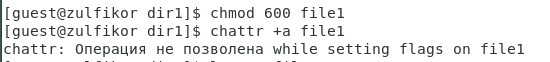
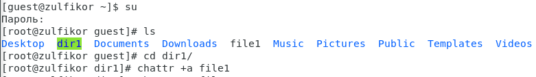
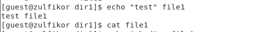
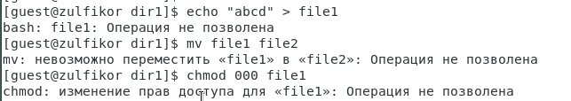
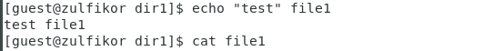
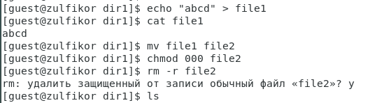
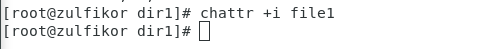
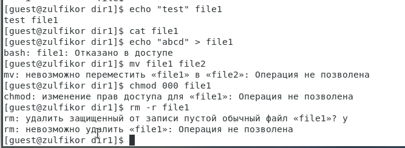

---
# Front matter
title: "Отчёт по лабораторной работе №4"
subtitle: "Дискреционное разграничение прав в Linux. Расширенные атрибуты"
author: "Аминов Зулфикор Мирзокаримович"

# Generic otions
lang: ru-RU
toc-title: "Содержание"

# Bibliography
bibliography: bib/cite.bib
csl: pandoc/csl/gost-r-7-0-5-2008-numeric.csl

# Pdf output format
toc: true # Table of contents
toc_depth: 2
fontsize: 12pt
linestretch: 1.5
papersize: a4
documentclass: scrreprt
## I18n
polyglossia-lang:
  name: russian
  options:
	- spelling=modern
	- babelshorthands=true
polyglossia-otherlangs:
  name: english
### Fonts
mainfont: PT Serif
romanfont: PT Serif
sansfont: PT Sans
monofont: PT Mono
mainfontoptions: Ligatures=TeX
romanfontoptions: Ligatures=TeX
sansfontoptions: Ligatures=TeX,Scale=MatchLowercase
monofontoptions: Scale=MatchLowercase,Scale=0.9
## Biblatex
biblatex: true
biblio-style: "gost-numeric"
biblatexoptions:
  - parentracker=true
  - backend=biber
  - hyperref=auto
  - language=auto
  - autolang=other*
  - citestyle=gost-numeric
## Misc options
indent: true
header-includes:
  - \linepenalty=10 # the penalty added to the badness of each line within a paragraph (no associated penalty node) Increasing the value makes tex try to have fewer lines in the paragraph.
  - \interlinepenalty=0 # value of the penalty (node) added after each line of a paragraph.
  - \hyphenpenalty=50 # the penalty for line breaking at an automatically inserted hyphen
  - \exhyphenpenalty=50 # the penalty for line breaking at an explicit hyphen
  - \binoppenalty=700 # the penalty for breaking a line at a binary operator
  - \relpenalty=500 # the penalty for breaking a line at a relation
  - \clubpenalty=150 # extra penalty for breaking after first line of a paragraph
  - \widowpenalty=150 # extra penalty for breaking before last line of a paragraph
  - \displaywidowpenalty=50 # extra penalty for breaking before last line before a display math
  - \brokenpenalty=100 # extra penalty for page breaking after a hyphenated line
  - \predisplaypenalty=10000 # penalty for breaking before a display
  - \postdisplaypenalty=0 # penalty for breaking after a display
  - \floatingpenalty = 20000 # penalty for splitting an insertion (can only be split footnote in standard LaTeX)
  - \raggedbottom # or \flushbottom
  - \usepackage{float} # keep figures where there are in the text
  - \floatplacement{figure}{H} # keep figures where there are in the text
---

# Цель работы

Получение практических навыков работы в консоли с расширенными
атрибутами файлов.

# Выполнение работы

## Определение расширенные атрибуты файла file1

От имени пользователя guest определили расширенные атрибуты файла file1
командой lsattr file1

{ #fig:001 width=100% height=100% }

## Установление права и расширенный атрибут a

Установили командой chmod 600 file1
на файл file1 права, разрешающие чтение и запись для владельца файла
и попробовали установить на файл file1 расширенный атрибут a от имени пользователя guest:
командой chattr +a /home/guest/dir1/file1

{ #fig:002 width=100% height=100% }

В ответ получили отказ от выполнения операции.

## Вход с правами администратора и установка расширенный атрибут а

Зашли с правами администратора с помощью команды su. 
Установили расширенный атрибут a на файл file1 от имени суперпользователя:
chattr +a /home/guest/dir1/file1

{ #fig:003 width=100% height=100% }

## Проверка правильность установления атрибута

От пользователя guest проверили правильность установления атрибута:
lsattr /home/guest/dir1/file1

{ #fig:004 width=100% height=100% }

## Дозапись в файл file1 слова «test»

Выполнили дозапись в файл file1 слова «test» командой
echo "test" /home/guest/dir1/file1
и выполнили чтение файла file1 командой
cat /home/guest/dir1/file1

{ #fig:005 width=100% height=100% }

Не удалось выполнить дозапись в файл file1

## Стерение имеющуюся в файл информацию и установка права

Попробовали стереть имеющуюся в файл инфор-
мацию командой
echo "abcd" > /home/guest/dirl/file1
и попробовали переименовать файл,
также попробовали с помощью команды chmod 000 file1
установить на файл file1 права запрещающие чтение и запись для владельца файла.

{ #fig:006 width=100% height=100% }

Не удалось стереть информацию, переименовать файл и установаить права 
запрещающие чтение и запись для владельца файла.

## Лишение расширенный атрибут a и проверка

Сняли расширенный атрибут a с файла file1 от
имени суперпользователя командой chattr -a /home/guest/dir1/file1

{ #fig:007 width=100% height=100% }

{ #fig:008 width=100% height=100% }

## Повторение операции

Повторили операции, которые ранее не удавалось выполнить.

{ #fig:009 width=100% height=100% }

{ #fig:010 width=100% height=100% }

Не удалось выполнить дозапись в файл file1, но удалось стереть информацию и дозапись в файл file1 слова «abcd»,
также удалось переименовать, установаить права запрещающие чтение и удалить файл.

## Замена атрибут «a» атрибутом «i» и проверка
Заменили атрибут «a» атрибутом «i».

{ #fig:011 width=100% height=100% }

{ #fig:012 width=100% height=100% }

## Повторение операции

{ #fig:013 width=100% height=100% }

Не удалось дозаписать информацию в файл и остальние действые.

# Выводы

В результате выполнения работы повысили свои навыки использова-
ния интерфейса командой строки (CLI), познакомились на примерах с тем,
как используются основные и расширенные атрибуты при разграничении
доступа.
